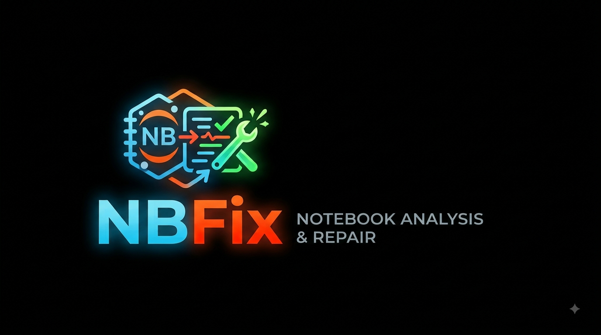

<p align="center">
  
</p>

# NBFix

[](https://github.com/psubotic/NBFix/actions/workflows/tests.yml)

Static analysis + LLM-assisted bug detection for data science notebooks.

NBFix parses notebook-cell code with its own grammar/parser (built on
[Lark](https://github.com/lark-parser/lark)) and builds a control-flow
graph and cross-cell def-use/dependency analysis from that. That structure
gets used two ways:

1. **Four deterministic analyses** run directly over the CFG/dependency
   graph, each catching one specific, provable bug class - no LLM involved,
   no false positives from a model guessing:
   - **Stale cell detection** — a cell is stale if it uses identifiers
     whose definitions were affected by changes made in another cell.
   - **Idle cell detection** — a cell is idle if running it (regardless of
     edits) can't change the state of any other cell.
   - **Isolated cell detection** — a cell is isolated if none of its
     definitions depend on identifiers from other cells, and none of its
     identifiers are used outside the cell.
   - **Data leakage analysis** — flags training a model on data that
     overlaps with its test set.
2. **LLM-assisted bug detection** (`src/nbfix/llm/`, opt-in - see
   [`llm/README.md`](src/nbfix/llm/README.md)) hands that *same*
   dependency graph to a local or hosted LLM as grounding context, for the
   broader class of bugs the four analyses above were never built to
   catch. The point of feeding it real structure (which cell defines what,
   what depends on what) rather than just raw code is that a small, cheap
   model shouldn't need to re-derive that cross-cell reasoning itself —
   it's exactly the kind of multi-hop dependency tracking that's
   hallucination-prone for a model and already computed exactly, for
   free, by the CFG. The goal is a small local model performing closer to
   a large hosted one, at a fraction of the cost, because the hard part of
   the reasoning was already done deterministically.

Both are still evolving (WIP) - see [`parser/README.md`](src/nbfix/parser/README.md)
and [`llm/README.md`](src/nbfix/llm/README.md) for the tracked backlog of
each.

## Project layout

```
src/nbfix/
  parser/       grammar, AST, CFG builder, def-use analysis (see parser/README.md)
  ir/           per-cell intermediate representation, built on top of parser/
  analyses/     the four analyses above, plus their abstract domains/states
  resource_utils/  local notebook/file loading
  serverextension/ jupyter_server REST extension exposing NBFix's events over HTTP
  llm/          LLM-assisted bug detection, opt-in (see llm/README.md)
  analyzer.py   NBFix: the top-level per-notebook analysis driver
  cli.py, events.py, benchmarker.py
tests/            pytest test suite + notebook fixtures
extension/        VS Code extension prototype (TypeScript, unfinished)
jupyterlab-nbfix/  JupyterLab labextension (TypeScript) - live diagnostics in the editor
```

## Getting started

```
pip install -e ".[dev]"
pytest tests/
```

## VS Code extension

`extension/` is an unfinished VS Code extension prototype that talks to a
local socket server to surface analysis results in the editor. It predates
the JupyterLab extension below and isn't currently buildable (no
`package.json`).

## JupyterLab extension

Live NBFix diagnostics inside JupyterLab - squiggly underlines on cells as
you edit, add, remove, and run them - are split across two packages so that
installing the JupyterLab UI (which needs `jupyterlab` and a Node/npm
toolchain at build time) never weighs down a plain `pip install nbfix`:

- `nbfix[jupyter]` - registers the `jupyter_server` REST API
  (`src/nbfix/serverextension/`) that runs NBFix's analysis engine
  against a notebook and returns diagnostics. Pure Python, no Node needed.
- `jupyterlab-nbfix/` - the JupyterLab labextension (TypeScript) that
  talks to that API and renders diagnostics via CodeMirror.

To use it in a running JupyterLab:

```
pip install "nbfix[jupyter]"
pip install ./jupyterlab-nbfix   # builds the labextension; needs Node/npm
jupyter lab
```

`jupyter server extension list` / `jupyter labextension list` should show
`nbfix.serverextension` and `jupyterlab-nbfix` respectively as enabled.
